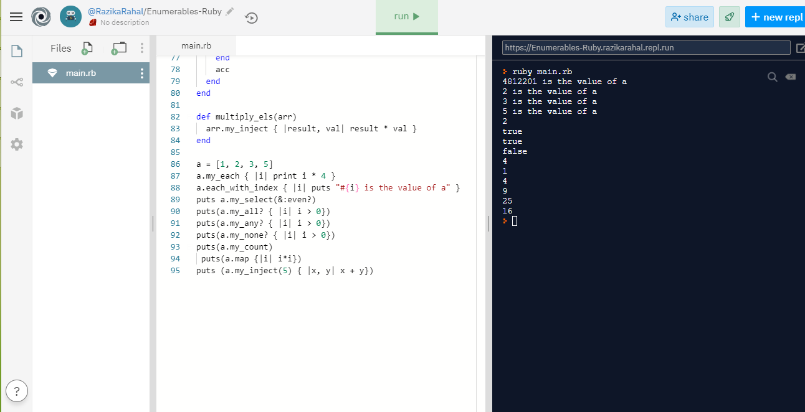

# Enumerables_Ruby

This project uses our methods for Enumerables in Ruby.The methods created are:

- #my_each
- #my_each_with_index
- #my_select
- #my_all?
- #my_any?
- #my_none?
- #my_count
- #my_map
- #my_inject

## Built With

- RUBY

## Getting Started

To get a local copy of the repository please run the following commands on your terminal:

- git clone https://github.com/Abidoyinsola1/Enumerables.git
- cd into above cloned directory
- run ruby enumerable.rb
- you can use your test codes to test the methods

## Authors

**Adeyemi Abiola Doyinsola**

- Github: [@Abidoyinsola1](https://github.com/Abidoyinsola1)
- Twitter: [@Abidoyinsola](https://twitter.com/abidoyinsola)
- LinkedIn: [Doyinsola Abiola Adeyemi](https://www.linkedin.com/in/doyinsola-adeyemi)

**Razika**

- Github: [@rahalrazika](https://github.com/rahalrazika)
- Linkedin : [Razika Rahal](https://www.linkedin.com/in/razika-rahal-85539bbb/)
- Twitter: [@RereRere055](https://twitter.com/RereRere055)

## Contributing

Contributions, issues and feature requests are welcome!

## Show your support

Give a  if you like this project
